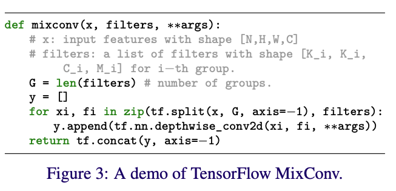
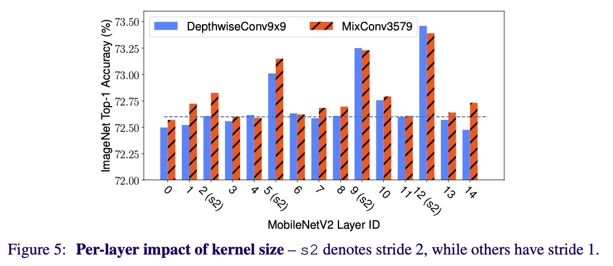

# [논문리뷰] MixConv: Mixed Depthwise Convolutional Kernels

## 1. Introduction

- Image classification 문제에 있어서 Convolutional neural networks(ConvNets)는 광범위하게 쓰였고, 정확도와 효율성 모두를 향상시키는 방향으로 발전하고 있다.
- Depthwise convolution은 각 독립적인 채널별로 연산을 수행하며, 계산 cost를 줄일 수 있어 최근 ConvNets에 활발히 사용되고 있다.
- 최근 연구에선 5x5, 7x7 처럼 커널이 크면 클 수록 잠재적으로 모델의 정확도와 효율성을 올릴 수 있다고 발표하였다.
    - 커널이 크면 클 수록 많은 디테일을 가지고 있는 high-resolution pattern을 얻을 수 있다.
- 본 논문에선 ‘커널이 크면 클 수록 항상 높은 성능을 낼 수 있는가?’라는 기본적인 질문을 던지고 있다.

- Figure 1에선 MobileNetV1과 MobileNetV2에 각각 3x3부터 13x13크기의 커널을 적용하여 실험을 해보았다.
    - 커널 사이즈가 3x3부터 7x7까지는 성능이 상승하였다.
    - 커널 사이즈가 9x9보다 커지는 순간 부터는 정확도와 효율성 모두 하락하였다.
- 본 논문에선 한 사이즈의 커널을 사용할 때의 한계를 설명하며, 아래 방법론들을 제안한다.
    - high-resolution pattern을 얻기 위하여 큰 사이즈의 커널과, low-resolution pattern을 얻기 위하여 작은 사이즈의 커널 모두 필요로 하며, 다양한 사이즈의 커널을 사용하여 정확도와 효율성 모두를 상승시킬 수 있다.

## 2. Related Work

### 2-1. Efficient ConvNets

- ConvNets의 효율성을 향상시키기 위해서 다양한 방법들이 시도되어왔다.
- Depthwise convolution이 mobile-size의 ConvNets에서 많이 쓰이고 있다.
    - MobileNets, ShuffleNets, MnasNet
- Depthwise convolution은 각 채널별로 독립적으로 커널 연산을 수행하며, 파라미터와 연산량을 줄일 수 있다.
- 본 논문에서 제안하는 MixConv는 depthwise convolution의 일반화된 컨셉이며, depthwise convolution의 drop-in replacement라고 볼 수 있다.

### 2-2. Multi-Scale Networks and Features

- 각 layer에 multiple branch를 사용함으로서, ConvNets의 한 layer에서 다양한 연산을 사용할 수 있다.
    - convolution, pooling
- 전의 연구들은 큰 관점에서 신경망의 구조를 바꾸는 것이었다면, 본 논문에서 제안하는 MixConv는 신경망의 구조를 그대로 두고, 그 구조 안에서 depthwise convolution에 약간의 변형을 주어 성능을 향상시키는 것을 목표로 하고 있다.

### 2-3. Neural Architecture Search

- 사람이 만든(hand-crafted) 모델보다 NAS 모델이 최근 연구에서 더 좋은 성적을 내고 있다.
- 본 논문에서도 MixConv를 NAS의 search space에 추가하여 최적의 구조를 찾도록 하였으며 이를 MixNets으로 정의하였다.

## 3. MixConv

- 본 논문에서 제안하는 MixConv의 메인 아이디어는 아래와 같다
    - 하나의 depthwise convolution 연산에서 다양한 크기의 커널을 사용하여 연산을 진행한다.
    - 이러한 방법으로 보다 쉽게 input image의 다양한 pattern을 얻을 수 있다.

### 3-1. MixConv Feature Map

- MixConv는 아래와 같은 과정을 거쳐 연산이 진행된다.
    - Figure2와 같이 input tensor는 g개의 그룹으로 나누어진다.
    - 각 그룹에 서로 다른 커널 사이즈를 적용시켜 convolution 연산을 진행하여 vertual kernel을 결과로 얻는다.
    - 연산의 결과값으로 나온 virtual kernel를 concat하여 최종 output tensor를 얻는다.
        
        
        

 

### 3-2. MixConv Design Choices

- **Group Size g**
    - 하나의 input tensor에 몇 개의 서로 다른 크기의 커널을 사용하는지 정한다.
    - g의 값이 4일 때 MobileNets에서 성능이 가장 좋았다.
    
- **Kernel Size Per Group**
    - 두 그룹이 같은 커널 크기를 갖는다면, 이는 하나의 그룹으로 merge하는 것과 동일한 효과를 갖는다.
    - 그러므로 각 그룹마다 서로 다른 크기의 커널을 갖도록 한다.
    - 3x3 크기부터 시작하여 2씩 늘어나도록 커널의 크기를 설정하였다.
    - 예를 들어 g=4일 때 커널의 크기는 {3x3, 5x5, 7x7, 9x9}가 된다.
    
- **Channel Size Per Group**
    - 두 가지의 channel partition 방법이 존재한다.
        - Equal partition
            - 각 그룹의 채널을 동일하게 할당한다.
            - g=4이고 total filter size가 32일 때, 채널을 (8, 8, 8, 8)로 할당한다.
        - Exponential partition
            - i 그룹의 채널을 전체 채널 수의 2^(-i)만큼 할당한다.
            - g=4이고 total filter size가 32일 때, 채널을 (16, 8, 4, 4)로 할당한다.
        
- **Dilated Convolution**
    - Dilated Convolution을 사용하여 parameter수와 연산을 증가시키지 않고 receptive field를 늘릴 수 있다.
    - 하지만 dilated convolution은 대체로 큰 크기의 커널을 사용하는 것 보다 낮은 성능을 보인다.
    

### 3.3 MixConv Performance on MobileNets

- MobileNets에서 classification과 detection task를 수행하여 성능을 측정하였다.
- 기존의 모든 3x3 depthwise convolution을 더 큰 크기의 커널로 바꾸어 depthwise convolution에 대한 실험을 진행하였으며, MixConv 또한 사용하여 실험을 진행하였다.
- MobileNets에서 실험을 진행하여 나온 결론은 아래와 같다.
    - MixConv는 일반적으로 훨씬 적은 수의 parameter와 FLOPS를 가지며, 정확도는 depthwise convolution보다 같거나 높다. 다양한 커널을 섞어 쓰는 것은 정확도와 효율성 두 방면에 상승 효과를 가져올 수 있다.
    - Figure 1에서 볼 수 있는 것과 같이, depthwise convolution은 커널의 크기가 일정 크기 이상으로 커지면 성능의 저하를 가져오는 반면, MixConv는 이러한 문제에 상대적으로 둔감하다.

### 3.4 Ablation Study

- **MixConv for Single Layer**
    - MixConv를 신경망 전체에 적용하는 것이 아닌 single layer에 적용했을 때의 결과는 Figure 5와 같다.
    
    
    
    - 대부분의 layer에선, 정확도에 큰 변화는 없었지만, stride가 2인 특정 layer에서는 정확도가 큰 폭으로 상승하였다.

- **Channel Partition Methods**
    - Figure 6에서 equal partition과 exponential partition을 사용하여 MixConv를 실행했을 때의 성능을 볼 수 있다.
    - Exponential partition은 같은 크기의 kernel에 대하여 적은 수의 parameter와 FLOPS를 가진다.
    
- **Dilated Convlution**
    - Dilated convolution은 작은 크기의 kernel에 대하여 어느정도 효과를 보였지만, 큰 크기의 kernel을 사용했을 때 정확도가 큰 폭으로 떨어졌다.
    - 큰 크기의 kernel에서 dilated rate가 큰 경우, dilated convolution을 실행할 때 많은 양의 local information을 잃어버리며, 정확도가 크게 떨어지게 된다.

참고: https://arxiv.org/pdf/1907.09595v3